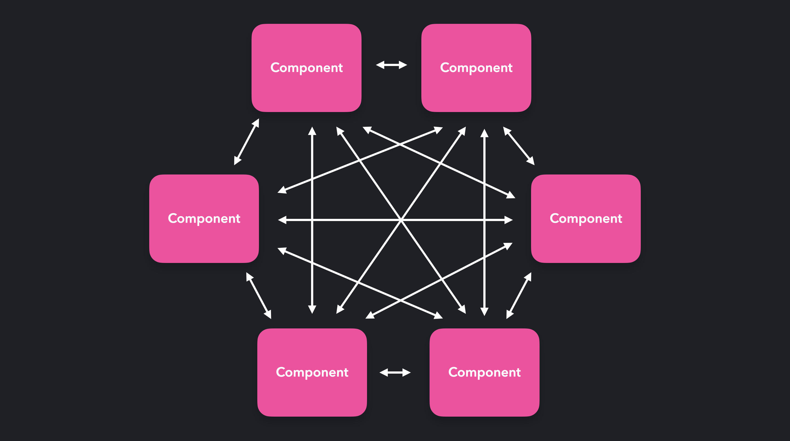
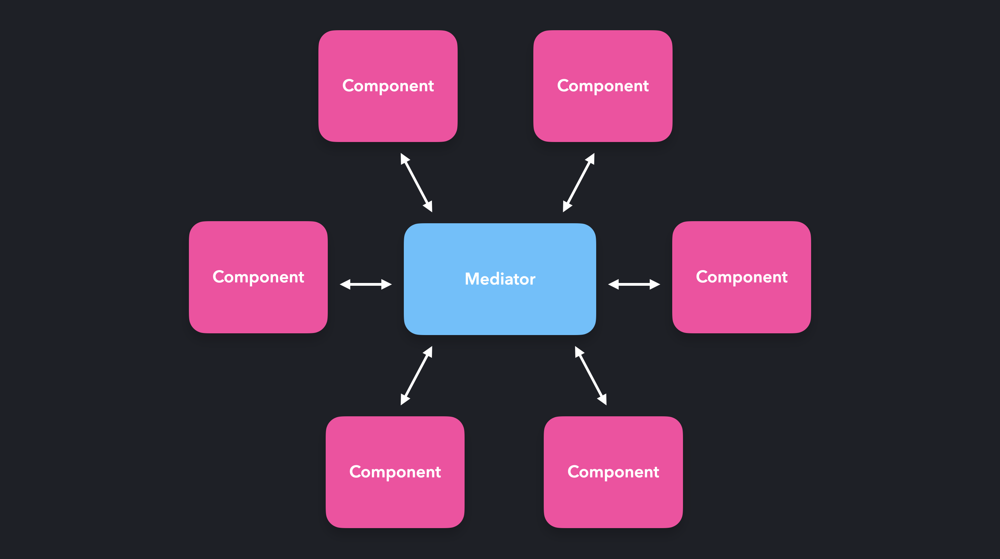
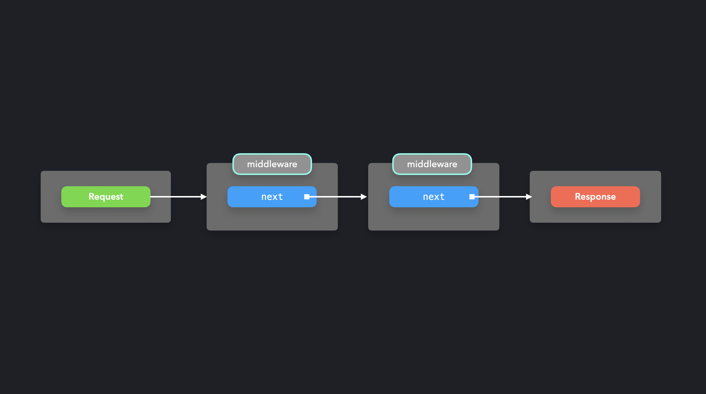

The mediator pattern makes it possible for components to interact with each other through a central point: the mediator. Instead of directly talking to each other, the mediator receives the requests, and sends them forward! In JavaScript, the mediator is often nothing more than an object literal or a function.

The communication between the components can get rather confusing if there is a large number of components.



Instead of letting every objects talk directly to the other objects, resulting in a many-to-many relationship, the object's requests get handled by the mediator. The mediator processes this request, and sends it forward to where it needs to be.



### Middleware

Middleware is a very popular among front-end world. It's a practice of mediator pattern in real life.

You can find middleware in two most popular nodejs server frame work 'Express' and 'Koa'.

```js
app.use('/', (req, res, next) => {
  req.headers['test-header'] = 1234
  next()
})
```

Middleware is a function sitting between `request` and `response`. By calling `next` function, the middleware hands over the process to the next middleware. So we can easily create a middleware chain between `request` and `response`.


