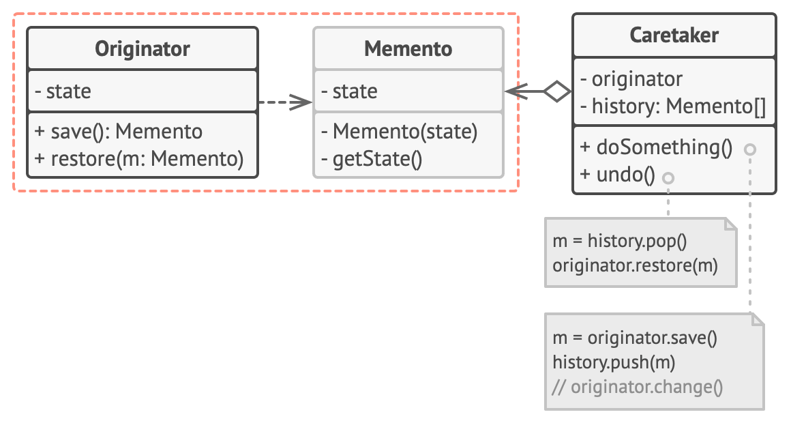

Memento is a behavioral design pattern that lets you save and restore the previous state of an object without revealing the details of its implementation.

### Problem

Memento pattern is oringinated from implementing undo. Imagine you're building a text editor. Undo is a very common feature for text editors. To implement this, editor should be able to store its state. The point is how to store the state and recover the state.

The most naive way is to store the editor object, or to copy all the information from the editor. Both of them have problems. The editor object contains not only useful informations but also many things like methods, which aren't what we want to store. The second one also has its problem, because some object properties might be private, so the outside world can't access it.

### Solution

The Memento pattern delegates creating state snapshots to the state owner, in our case, the editor, which solves the second issue. Because the editor is the state owner, so it can access all the state data. In addition, memento pattern suggests storing the snapshot in a special object called `memento`. The contents of the memento aren’t accessible to any other object except the one that produced it. Other objects must communicate with mementos using a limited interface which may allow fetching the snapshot’s metadata (creation time, the name of the performed operation, etc.), but not the original object’s state contained in the snapshot.

Such a restrictive policy lets you store mementos inside other objects, usually called caretakers. Since the caretaker works with the memento only via the limited interface, it’s not able to tamper with the state stored inside the memento. At the same time, the originator has access to all fields inside the memento, allowing it to restore its previous state at will.

