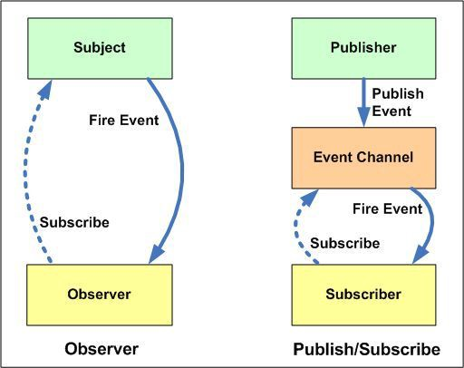

With the **observer pattern**, we can subscribe certain objects, the **observers**, to another object, called the **observable**. Whenever an event occurs, the observable notifies all its observers!

An observable object usually contains 4 important parts:

- `observers`: an array of observers that will get notified whenever a specific event occurs
- `subscribe()`: a method in order to add observers to the observers list
- `unsubscribe()`: a method in order to remove observers from the observers list
- `notify()`: a method to notify all observers whenever a specific event occurs

### Implementation

```js
class Observable {
  constructor() {
    this.observers = new Set()
  }

  subscribe(func) {
    this.observers.add(func)
  }

  unsubscribe(func) {
    this.observers.delete(func)
  }

  notify(data) {
    this.observers.forEach((observer) => observer(data))
  }
}
```

### Pros

Using the observer pattern is a great way to enforce separation of concerns and the single-responsiblity principle. The observer objects aren’t tightly coupled to the observable object, and can be (de)coupled at any time. The observable object is responsible for monitoring the events, while the observers simply handle the received data.

### Cons

If an observer becomes too complex, it may cause performance issues when notifying all subscribers.

### Observer Pattern and Publisher Subscriber Pattern

Beforw talking about these two very similar patterns. I'd like to clarify the roles in different patterns and their relationships.

In Observer Pattern, `Observers` are observes `Observables` or `Subjects`.
In Pub-Sub(Publisher-Subscriber) Pattern, `Subscribers` are subscribed to `Publishers`.

The `Subjects` notifies the `Observers` just as the `Publishers` notifies their `Subscribers`.

As you can see, they're conceptually the same. Before writing this article, I had known there were these two similar patterns. And I googled the difference of them. Most are saying that the biggest difference is the pub/sub pattern is more decoupled. The pub/sub pattern has a `Event Channel` between publishers and subscribers. The publishers and subscribers don't know each other. In the blow image, you can have a look at their structures.



However, in my opinion, it doesn't make sense to treat these them as different patterns. Because the only difference is whether putting the `Event Channel` into the `Publisher(Subject)` or not. But the core underlying implementation of the `Event Channel` is the same. It's just the `Observable` class in the code above. If you still don't get it, take a look at the code below.

```js
class Subject extends Observable {}

class Publisher {
  constructor(observable) {
    this.observable = observable
  }
}
```

There're other differences mentioned in my search result. For example, the Observer Pattern is mostly implemented synchronously, while the pub/sub pattern is mostly implemented asynchronously. But I think those are just some specific implementations when it comes to the real application and they shouldn't be counted as "Different Patterns".

So my conclusion is there're no differences of Observer and Pub/sub Patterns. They're just two names of the same pattern.
