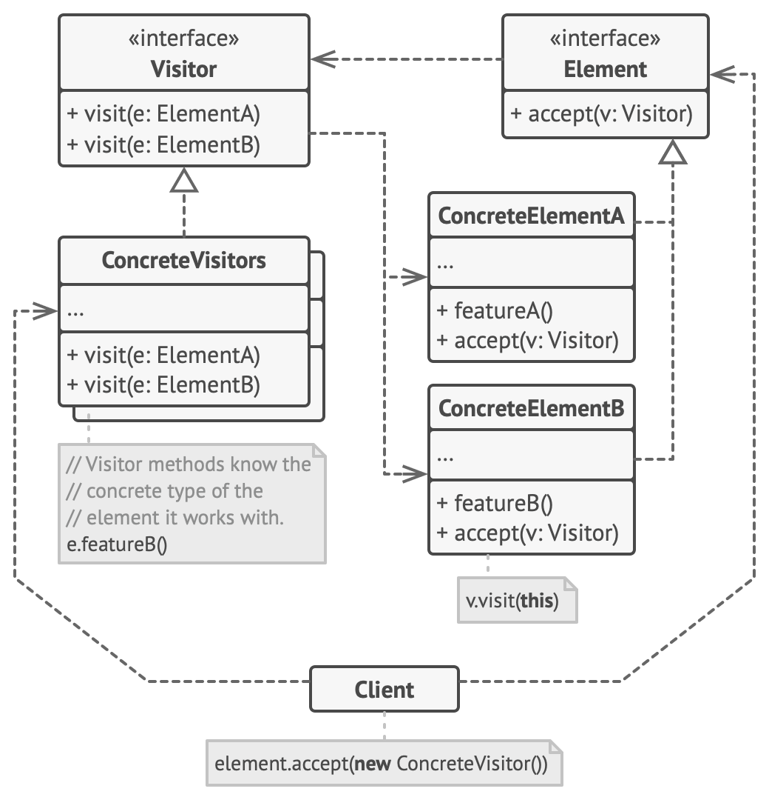

**Visitor** is a behavioral design pattern that lets you separate algorithms from the objects on which they operate.

### Problem

Imagine that your team develops an app which works with geographic information structured as one colossal graph. Each node of the graph may represent a complex entity such as a city, but also more granular things like industries, sightseeing areas, etc. The nodes are connected with others if there’s a road between the real objects that they represent. Under the hood, each node type is represented by its own class, while each specific node is an object.

At some point, you got a task to implement exporting the graph into XML format. At first, the job seemed pretty straightforward. You planned to add an export method to each node class and then leverage recursion to go over each node of the graph, executing the export method. The solution was simple and elegant: thanks to polymorphism, you weren’t coupling the code which called the export method to concrete classes of nodes.

Unfortunately, the system architect refused to allow you to alter existing node classes. He said that the code was already in production and he didn’t want to risk breaking it because of a potential bug in your changes.

Besides, he questioned whether it makes sense to have the XML export code within the node classes. The primary job of these classes was to work with geodata. The XML export behavior would look alien there.

There was another reason for the refusal. It was highly likely that after this feature was implemented, someone from the marketing department would ask you to provide the ability to export into a different format, or request some other weird stuff. This would force you to change those precious and fragile classes again.

### Solution

The Visitor pattern suggests that you place the new behavior into a separate class called visitor, instead of trying to integrate it into existing classes. The original object that had to perform the behavior is now passed to one of the visitor’s methods as an argument, providing the method access to all necessary data contained within the object.

Now, what if that behavior can be executed over objects of different classes? For example, in our case with XML export, the actual implementation will probably be a little bit different across various node classes. Thus, the visitor class may define not one, but a set of methods, each of which could take arguments of different types, like this:

```js
class ExportVisitor implements Visitor {
  doForCity(c: City) {}
  doForIndustry(f: Industry) {}
  doForSightSeeing(ss: SightSeeing) {}
  // ...
}
```

But how exactly would we call these methods, especially when dealing with the whole graph? These methods have different signatures, so we can’t use polymorphism. To pick a proper visitor method that’s able to process a given object, we’d need to check its class. Doesn’t this sound like a nightmare?

```js
for (let node of graph) {
  if (node instanceof City) exportVisitor.doForCity(node)
  if (node instanceof Industry) exportVisitor.doForIndustry(node)
  // ...
}
```

However, the Visitor pattern addresses this problem. It uses a technique called _Double Dispatch_, which helps to execute the proper method on an object without cumbersome conditionals. Instead of letting the client select a proper version of the method to call, how about we delegate this choice to objects we’re passing to the visitor as an argument? Since the objects know their own classes, they’ll be able to pick a proper method on the visitor less awkwardly. They “accept” a visitor and tell it what visiting method should be executed.

```ts
for (let node of graph) node.accept(exportVisitor)

interface VisitedNode {
  accept(v: Visitor)
}
class City implements VisitedNode {
  accept(v: Visitor) {
    v.doForCity(this)
  }
}
class Industry implements VisitedNode {
  accept(v: Visitor) {
    v.doForIndustry(this)
  }
}
```

I confess. We had to change the node classes after all. But at least the change is trivial and it lets us add further behaviors without altering the code once again.

Now, if we extract a common interface for all visitors, all existing nodes can work with any visitor you introduce into the app. If you find yourself introducing a new behavior related to nodes, all you have to do is implement a new visitor class.


