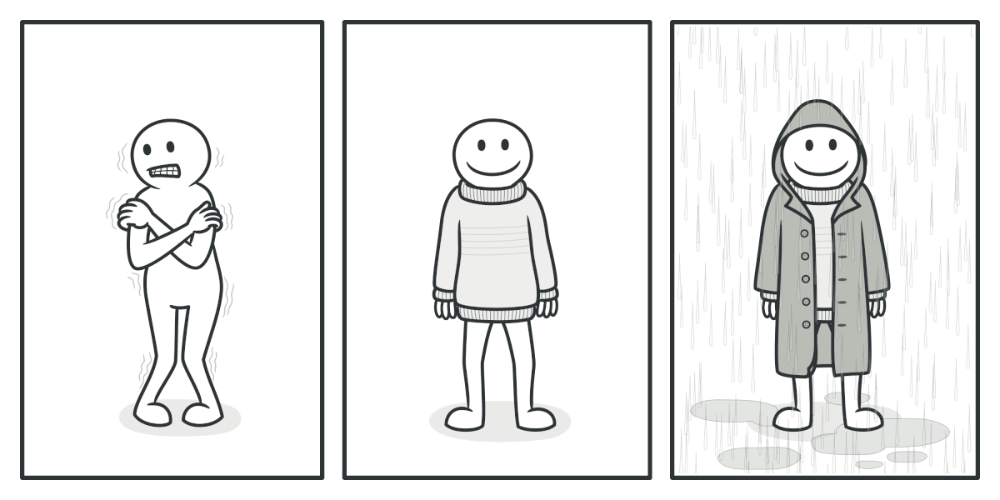

### Decorator pattern is not recommended in JS

Decorator is a structural design pattern that aims to promote code re-use. Similar to Mixins, they can be considered another viable alternative to object sub-classing.

Decorator is a classic design pattern. As mentioned, decorator and mixins are similar. But due to language feature difference, traditional programming languages can't or it's unnatural form them to use mixin. However, for JavaScript, Mixin is a more natural and popular way to add additional feature on objects.

### Why decorator

They can be used to modify existing systems where we wish to add additional features to objects without the need to heavily modify the underlying code using them. A common reason why developers use them is their applications may contain features requiring a large number of distinct types of objects. Imagine having to define hundreds of different object constructors for say, a JavaScript game.

The object constructors could represent distinct player types, each with differing capabilities. A Lord of the Rings game could require constructors for `Hobbit`, `Elf`, `Orc`, `Wizard`, `Mountain Giant`, `Stone Giant`, and so on, but there could easily be hundreds of these. If we then factored in capabilities, imagine having to create sub-classes for each combination of capability types e.g `HobbitWithRing`, `HobbitWithSword`, `HobbitWithRingAndSword`, and so on. This isn't very practical and certainly isn't manageable when we factor in a growing number of different abilities.

### A real world analogy

Wearing clothes is an example of using decorators. When you’re cold, you wrap yourself in a sweater. If you’re still cold with a sweater, you can wear a jacket on top. If it’s raining, you can put on a raincoat. All of these garments “extend” your basic behavior but aren’t part of you, and you can easily take off any piece of clothing whenever you don’t need it.
